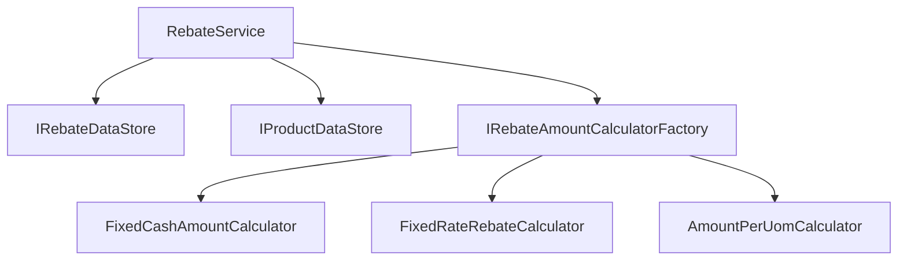

# Smartwyre Developer Test

[Jump to the original instructions](#original-exercise-instructions)

## How to run

    dotnet run --project Smartwyre.DeveloperTest.Runner

Available rebates: `cash`, `rate`, `uom`
Available products: `soy`, `rice`, `corn`

Type `exit` at the rebate prompt to quit.

## Definition of Done

- [x] Solution builds
- [x] All existing tests pass (`dotnet test`)
- [x] Adding a new `incentive type` without modifying `RebateService`
- [x] Runner executes end-to-end with real input
- [x] Invalid input is handled gracefully without crashing
- [x] No raw stack traces or internal details are leaking
- [ ] Two new incentive types are implemented

## Not requested, nice to have

- [x] Build badge at the top of this README
- [x] Smoke test covering the main execution path
- [x] GitHub Actions workflow running `dotnet build`, `dotnet test` on every push and pull requests
- [x] `dotnet list package --vulnerable` as a workflow step

## Refactor needed

- `RebateService.Calculate` does lookup, validation, calculation and persistence in one method. (Mixed concerns, hard to test and maintain)
- Data stores instantiated directly inside the service, not injected. (Tight coupling, no abstraction)
- New `incentive type` means editing the whole method. (Poor extensibility, needs refactoring for new types)
- `CalculateRebateResult` exposes only success/failure, no reason.
- `FixedCashAmount` missing a null check, risking a null reference exception.
- No exception handling.

## Assumptions

- Negative `volume` is treated as invalid input. Original code only checked for zero.
- Runner loops instead of exiting after one calculation. Exercise doesn't specify either way.

## Plan

1. Remove empty test (`PaymentService`), add missing project references, fix launch.json, enable ImplicitUsings.

2. Extract data store interfaces, add sample data in memory, test.
   RebateCalculation now has a full audit trail.

3. Extract one calculator class per `incentive type`, test each.

4. Add a factory that resolves the right calculator + test.

5. Refactor `RebateService` to use the abstractions. Unit test with fakes + one integration test wiring the real data stores and factory.

6. Connect the runner. Validate input with TryParse. Add a global exception handler for graceful failure handling, suppress sensitive information leak.

7. Update this README.

## Dependencies

## Adding a new incentive type

1. Add the value to `IncentiveType` enum.
2. Create a class implementing `IRebateAmountCalculator`.
3. Register it in `IRebateAmountCalculatorFactory`.

---

## Original exercise instructions

# Smartwyre Developer Test Instructions

You have been selected to complete our candidate coding exercise. Please follow the directions in this readme.

Clone, **DO NOT FORK**, this repository to your account on the online Git resource of your choosing (GitHub, BitBucket, GitLab, etc.). Your solution should retain previous commit history and you should utilize best practices for committing your changes to the repository.

You are welcome to use whatever tools you normally would when coding, including documentation, libraries, frameworks, or AI tools (such as ChatGPT or Copilot).

However, it is important that you fully understand your solution. As part of the interview process, we will review your code with you in detail. You should be able to:

- Explain the design choices you made.
- Walk us through how your solution works.
- Make modifications or extensions to your code during the review.

Please note: if your submission appears to have been generated entirely by an AI agent or another third party, without your own understanding or contribution, it will not meet our evaluation criteria.

# The Exercise

In the 'RebateService.cs' file you will find a method for calculating a rebate. At a high level the steps for calculating a rebate are:

 1. Lookup the rebate that the request is being made against.
 2. Lookup the product that the request is being made against.
 2. Check that the rebate and request are valid to calculate the incentive type rebate.
 3. Store the rebate calculation.

What we'd like you to do is refactor the code with the following things in mind:

 - Adherence to SOLID principles
 - Testability
 - Readability
 - Currently there are 3 known incentive types. In the future the business will want to add many more incentive types. Your solution should make it easy for developers to add new incentive types in the future.

We'd also like you to 
 - Add some unit tests to the Smartwyre.DeveloperTest.Tests project to show how you would test the code that you've produced 
 - Run the RebateService from the Smartwyre.DeveloperTest.Runner console application accepting inputs (either via command line arguments or via prompts is fine)

The only specific "rules" are:

- The solution must build
- All tests must pass

You are free to use any frameworks/NuGet packages that you see fit. You should plan to spend around 1 hour completing the exercise.

Feel free to use code comments to describe your changes. You are also welcome to update this readme with any important details for us to consider.

Once you have completed the exercise either ensure your repository is available publicly or contact the hiring manager to set up a private share.
